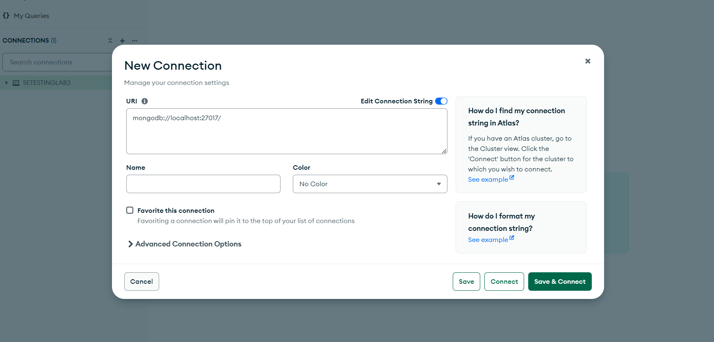

# Originally developed by

HasancanCakicioglu @ Github.com

# Notes

Used for testing by Legayada, Surilla only for academic purposes and not for profit. Under the MIT License. This program is a BACKEND Application and has no FrontEnd, all testing done is mainly for the Backend using Supertest and Jest

# Installation

1. Clone the repository

```bash
git clone https://github.com/itsantonle/SETESTINGLAB3LEGAYADASURILLA.git
```

2. Set up the environment variables (sample .env below)

by default the server runs on localhost://3009

```txt
 MONGODB_URI=
 JWT_SECRET=
 PORT=
```

3. Get a MongoDB URI:

Local (via bash)

start the mongodb service (automatic if installed)

```bash
mongod
```

this runs on on mongodb://localhost:27017 so the default URI is

```bash
mongodb://localhost:27017/<name-of-database>

```

Local (via MongoDB Compass)

download MongoDB compass
[MongoDB Compass Official Download Page](https://www.mongodb.com/try/download/compass)

Open MongoDB Compass and click to add a new connection:


Copy your URI to your .env file

4. The JWT Secret can be generated or you can just write it(NOT RECOMMENDED)
   [GENERATE JWT SECRET](https://jwtsecret.com/generate)

5. Run the server

listens to port 3009 by default

```bash
npm run dev
```

6. Use thunderclient or Postman to send example your own requests

Example POST REQUEST TO /api/auth/signup
not filling out all the fields will trigger the validation middleware to send a 400 Bad Request

```js
{
   "username": "TestUser",
   "email": "testuser@test.com",
   "password": "testpassword"
}
```

# Testing

7. Run the test suite (NOT WORKING RN)

# MERN Authentication Backend Project

This project is a nodejs backend built for MERN (MongoDB, Express.js, React.js, Node.js) stack. It provides user authentication functionality, allowing users to sign up, sign in, and access protected routes using JSON Web Tokens (JWT).

## Features

- User registration (Sign Up)
- User authentication (Sign In)
- Access control with JWT
- Protected routes for authenticated users
- Password hashing with bcrypt.js
- MongoDB database integration with Mongoose ODM

## Technologies Used

- MongoDB: A NoSQL database for storing user data.
- Express.js: A backend web application framework for Node.js.
- Node.js: A JavaScript runtime environment for executing server-side code.
- JWT (JSON Web Tokens): A compact, URL-safe means of representing claims to be transferred between two parties.
- bcrypt.js: A library to help hash passwords securely.

## Installation

1. Clone the repository:

   ```bash
   git clone https://github.com/HasancanCakicioglu/mern-auth-backend.git
   ```

2. Navigate to the project directory:

   ```bash
   cd mern-auth-backend
   ```

3. Install dependencies for the backend:

   ```bash
   npm install
   ```

4. Set up environment variables:

   - Create a `.env` file in the root directory.
   - Define the following environment variables:
     ```
     MONGODB_URI=<your_mongodb_uri>
     JWT_SECRET=<your_jwt_secret>
     PORT=<your_port>
     ```

5. Start the development server:

   ```bash
   npm run dev
   ```

6. Access the application in your browser at `http://localhost:3000`.

## Usage

- Register a new user by providing a username, email, and password.
- Sign in with your registered email and password to access protected routes.
- After signing in, you'll receive a JWT token, which you can use to access protected routes.
- Access protected routes by including the JWT token in the request headers (e.g., `Authorization: Bearer <token>`).

## Contributing

Contributions are welcome! If you'd like to contribute to this project, please follow these steps:

1. Fork the repository.
2. Create a new branch (`git checkout -b feature/my-feature`).
3. Make your changes and commit them (`git commit -am 'Add new feature'`).
4. Push to the branch (`git push origin feature/my-feature`).
5. Create a new pull request.

## License

This project is licensed under the [MIT License](LICENSE).

## Acknowledgements

- [MongoDB](https://www.mongodb.com/)
- [Express.js](https://expressjs.com/)
- [Node.js](https://nodejs.org/)
- [jsonwebtoken](https://www.npmjs.com/package/jsonwebtoken)
- [bcrypt.js](https://www.npmjs.com/package/bcryptjs)
